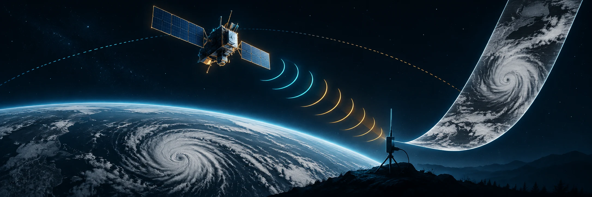

<picture>
  
</picture>

<h1 align="center">satelita</h1>

<p align="center">
  Receive, decode, and track NOAA weather-satellite transmissions from your desktop.
</p>

<p align="center">
  <a href="https://github.com/unfixed3854/satelita/actions/workflows/ci.yml"></a>
  <a href="LICENSE"></a>
</p>

Satelita turns an RTL-SDR dongle into a focused workstation for NOAA APT
reception. It combines live signal feedback, image decoding, recording
management, and pass prediction in one native desktop interface.

## Highlights

- Live grayscale APT decoding with signal level, clipping, and sync-lock
  feedback
- NOAA-15, NOAA-18, and NOAA-19 reception presets
- Final calibrated channel images produced by SatDump
- Offline world map with satellite positions, ground tracks, reception
  footprints, and the day/night terminator
- 24-hour pass predictions for your ground station
- Local recording library with channel isolation and full-resolution viewing

## Requirements

- [Deno](https://deno.com/) 2.9 or newer
- [`rtl_fm` and `rtl_test`](https://github.com/steve-m/librtlsdr),
  [`sox`](https://sourceforge.net/projects/sox/), and
  [`satdump`](https://github.com/SatDump/SatDump) available on `PATH`
- An RTL-SDR dongle and a suitable antenna for live reception

The interface, tests, and web build can be used without radio hardware. Live
capture and final decoding require the external tools above.

## Quick start

```bash
git clone https://github.com/unfixed3854/satelita.git
cd satelita
deno install
deno task preview
```

`preview` opens the app in a native development window with hot reload. For
browser-only interface work, use `deno task dev` and open
<http://localhost:1420>.

## Commands

| Command             | Purpose                                             |
| ------------------- | --------------------------------------------------- |
| `deno task dev`     | Run the browser development server                  |
| `deno task preview` | Run the native desktop app with hot reload          |
| `deno task test`    | Run the Deno test suite                             |
| `deno task build`   | Build the web app and type-check it                 |
| `deno task bundle`  | Produce the native package for the current platform |

Native packages are written to `dist/` as an AppImage on Linux, an app bundle on
macOS, or an MSI on Windows.

## Data and network access

Recordings, station settings, and cached orbital elements stay in the standard
application-data directory:

| Platform | Location                                                                       |
| -------- | ------------------------------------------------------------------------------ |
| Linux    | `$XDG_DATA_HOME/com.magmast.satelita` or `~/.local/share/com.magmast.satelita` |
| macOS    | `~/Library/Application Support/com.magmast.satelita`                           |
| Windows  | `%APPDATA%\com.magmast.satelita`                                               |

On first run, Satelita asks [ipwho.is](https://ipwho.is/) for an approximate
location so it can calculate passes; entering coordinates manually replaces that
value. Orbital elements are refreshed from [CelesTrak](https://celestrak.org/)
at most once per day and cached for offline use. The app contains no analytics
or telemetry.

## Project status

Satelita is pre-1.0 software. The Linux build and AppImage packaging path are
tested; macOS and Windows packaging is configured but has not yet been
exercised. Please report reproducible problems through
[GitHub Issues](https://github.com/unfixed3854/satelita/issues).

See [CONTRIBUTING.md](CONTRIBUTING.md) for development notes and pull-request
guidance. Please use the private process in [SECURITY.md](SECURITY.md) for
security reports.

## License

[MIT](LICENSE) © 2026 Maciej Augustyniak
